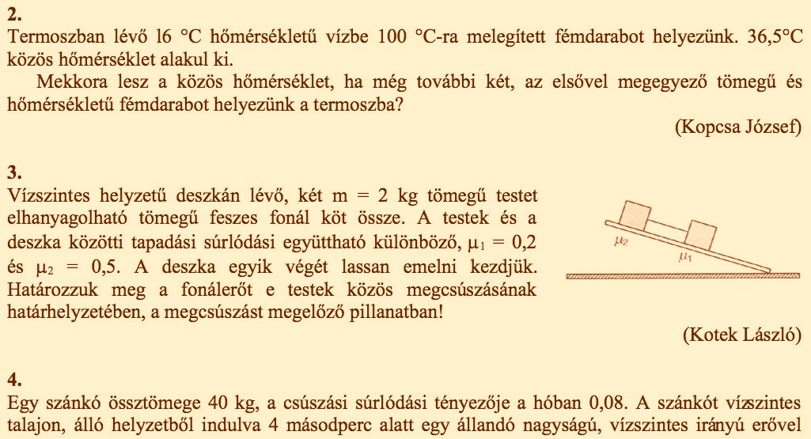

# Introduction
## My first program

## My first useful program

## My first investment in data science

## My three hats
1. Research
2. Teaching
3. Reproducibility

## Research
Where: CEU MicroData, KRTK

What: firm and worker behavior in the face of globalization and technical change. Mostly observational data.

## Teaching
Where: CEU, European Economic Association, Carpentries, CodedThinking

## Reproducibility
Where: Data Editor at Review of Economic Studies (#5 journal in economics)

What: Ensure data and code produce results published. Educate authors about best practices.

# Academic Research
## Features of academic research
1. Always new questions, always new data
2. Often new methods (!)
2. Batch processing of "historical" data
3. Full transparency (!)

# My Tools
## The pragmatic programmer

## Generic tools and technologies
1. Plain text: .csv, .md, .yaml, .tex
2. Command line: 
3. Version control: git, GitHub, Sublime Merge
4. Dependency management: Make, bead

## Specific tools and technologies
1. Data wrangling: Python (not pandas, not .ipynb), Stata
2. Statistics: Stata (no R jokes please) 
3. Simulation: Julia

# Recent Projects
## Recent projects
* Business Disruptions from Social Distancing
* Expatriate Managers in International Trade
* Political Favoritism in Public Procurement
* CEU-MTA Business Relations Survey

# Live Demo