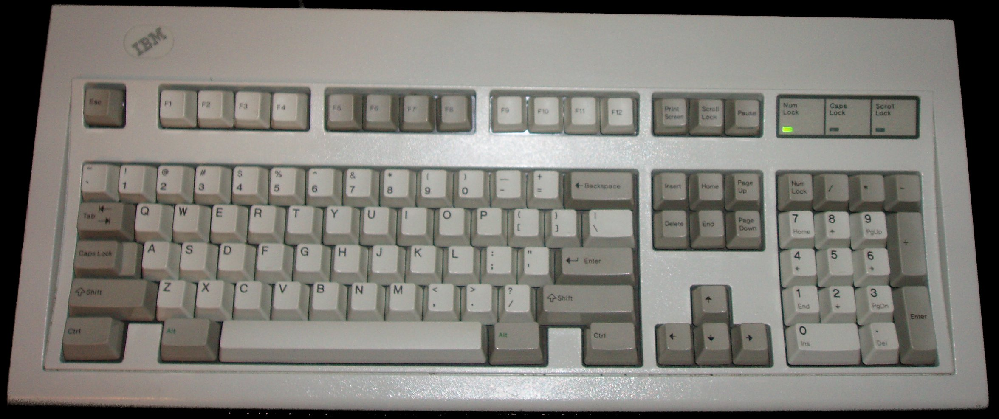

# Introduction
## My first program

## My first useful program

## My first investment in data science

## My three hats
1. Research
2. Teaching
3. Reproducibility

## Research
Where: CEU MicroData, KRTK

What: firm and worker behavior in the face of globalization and technical change. Mostly observational data.

## Research is fun

## Especially when combined with play

## Teaching
Where: CEU, European Economic Association, Carpentries, CodedThinking

## Reproducibility
Where: Data Editor at Review of Economic Studies (#5 journal in economics)

What: Ensure data and code produce results published. Educate authors about best practices.

# Academic Research
## Features of academic research
1. Always new questions, always new data
2. Often new methods (!)
3. Batch processing of "historical" data
4. Diverse and changing team
5. Full transparency (!)

# My Tools
## The pragmatic programmer

## Generic tools and technologies
1. Plain text: .csv, .md, .yaml, .tex
2. Command line: fish, stdin, stdout, csvkit
3. Version control: git, GitHub, Sublime Merge
4. Dependency management: Make, bead

## Specific tools and technologies
1. Data wrangling: Python (not pandas, not .ipynb), Stata
2. Statistics: Stata (no R jokes please) 
3. Simulation: Julia

# Recent Projects
## Recent projects
* [Business Disruptions from Social Distancing](https://github.com/ceumicrodata/social-distancing)
* [Expatriate Managers in International Trade](https://github.com/korenmiklos/expat-analysis)
* Political Favoritism in Public Procurement
* CEU-MTA Business Relations Survey

# Live Demo
## Home bias in public procurement
1. Get data form Tenders Electronic Daily on EU procurement
2. Check how many tenders are won by firms in the same country as the buyer
3. Keep all steps reproducible. Tools used:
    - Make
    - git
    - csvkit
    - SQL

## Data sources
- [Tenders Electronic Daily 2009](https://data.europa.eu/euodp/en/data/dataset/ted-csv/resource/7caee4eb-0fc0-4fc0-ad1a-c970e63b40b4)
- [Country codes](https://www.datahub.io/core/country-codes)

# Bead

## Problem
- Where do I find this data?
- Where did this data come from?
- How did we create this data?

## Existing solutions
- Orhcestration systems: KNIME, Airflow, Luigi, Bubbles, TARR 
- People talking to people

## Bead
- Distributed: each analyst only responsible for their computation
- Tool agnostic: any data stored in flat files, any script callable from the command line (not enforced)

## Key concepts
A **bead** is a .zip file encapsulating

1. data
2. code used to compute it
3. *reference* to its inputs 

## Setup
- [Setup instructions](https://handbook.microdata.io/onboarding/setup#bead)

