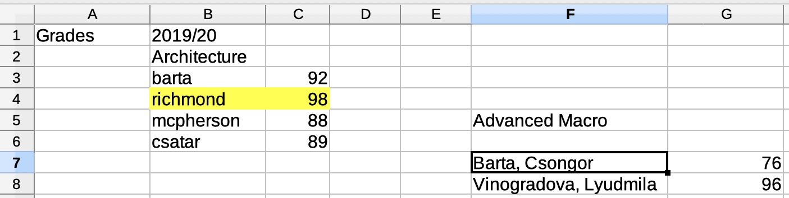
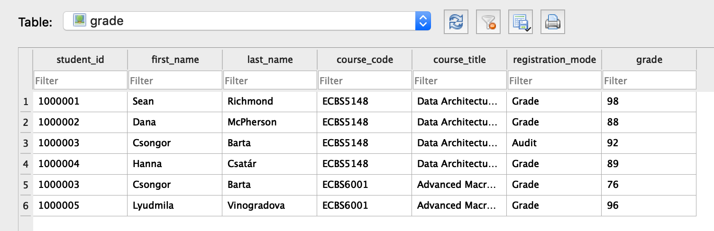
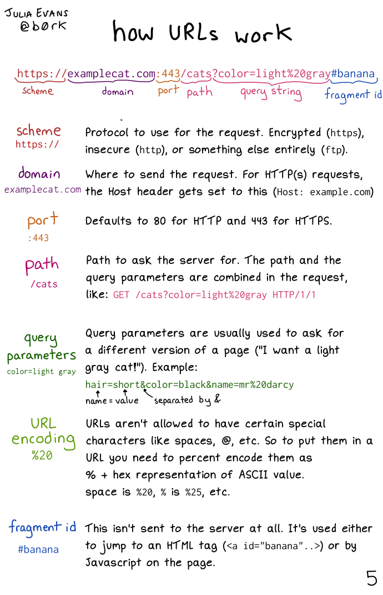
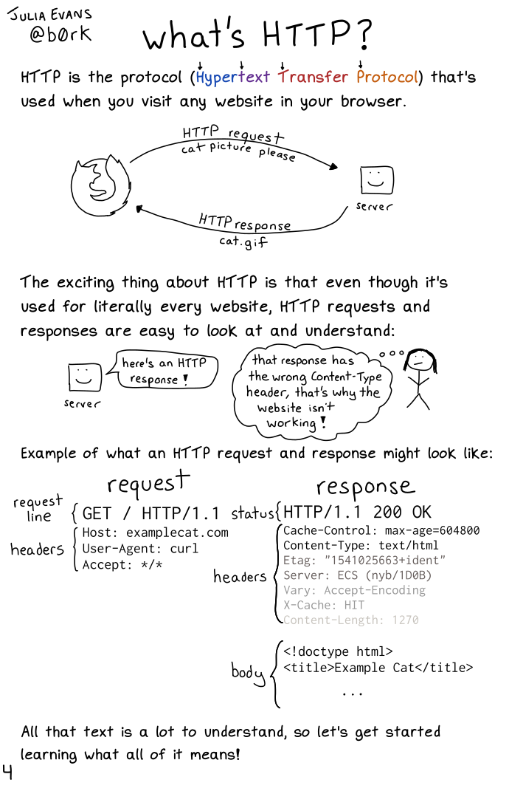

# Tidy data
## Data vs story
Contrary to the aphorism, data is *not* the plural of anecdote.
- known structure
- known collection method

## Benefits of (more) data
- Less subject to selection/recall bias.
- Statistical learning can be applied.

## Drawbacks of (more) data
- Harder to work with.
- Harder to interpret/relate to.
- May give false sense of knowledge.

## Tidy data
1. Every row is an observation (case, record)
2. Every column is a variable (feature, attribute)
3. Every cell contains a single value

## Spreadsheet as a canvas

## Same content in tidy form

## Benefits
- Machine readable
- Can select columns (=variables)
- Can filter rows (=observations)
- Can sort rows
- Can join rows

# Spreadsheets
## Learn to love your spreadsheet editor
- Beware of Excel! Good alternatives: Libre Office, Open Office, Google Sheets.

## Useful steps
- filter
- sort
- vlookup

# Exercise

# Getting data
## What's in a URL?

## What's HTTP?

## API, CSV, XML and JSON
The world of data is full of acronyms. 

* API: Application Programming Interface, the language in which machines talk to one another. Useful for automating data gathering and updating.
* CSV: Comma Separated Values, a plain text format for data tables. Everything can read it and write it (beware of Excel).
* XML: Extensible Markup Language, a structured document format to store hierarchical data. Very widely used, but not human friendly.
* JSON: JavaScript Object Notation, the de facto web standard for sharing structured data. Similar to XML, but much more legible.

## Scraping
scraping = crawling + parsing

## Four steps of a scraping project
1. Recon
2. Crawl
3. Parse
4. Store

## Recon
1. Locate the interesting documents and tables
2. Note the structure of URLs and tables
3. Explore `robots.txt` and terms of use
4. Explore robot protection

## Crawl
1. Download the pages you need.
2. Verify that you have the correct number of pages.

## Parse
1. Find and extract the information within the HTML structure.
2. Verify that you have everything you need. (Save link to original!)

Crawling and parsing often done together in scraping apps.

# Exercise
